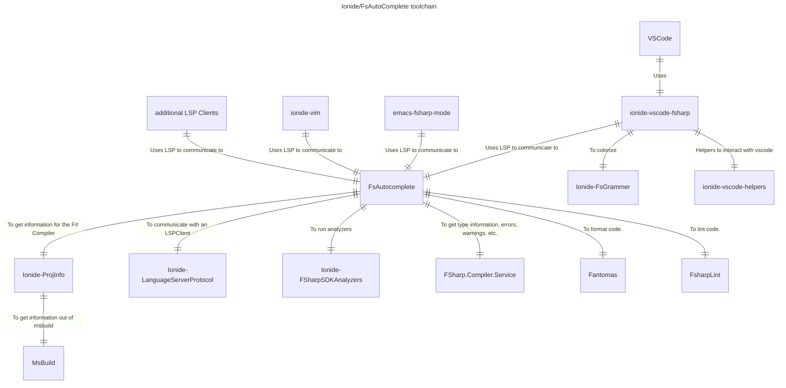

# Ionide

Ionide is an organization which builds **high quality, cross platform developer tools for F#**. Our flagship project is Ionide-VSCode - a Visual Studio Code plugin, with more than 1 million downloads, transforming VSCode into a **fully-fledged F# IDE**. But Ionide is more than just an editor plugin - we build a whole ecosystem of developer tools - from a [documentation generator](Tools/fornax.html), to an [F# LSP server](Tools/fsac.html), to experimental and innovative projects like [F# Analyzers](Libraries/fsanalyzers.html).

### Our goals and motivations

> We build cross platform, F# developer tooling

* Provide cross platform, open source developer tooling for F#
* Provide a high quality IDE experience
* Innovate in the area of development tooling for F# / FP languages
* Provide a set of opinionated tools that work well together
* Focus on UX, everything should Just Work™
* Contribute to the general F# OSS ecosystem

### Toolchain

